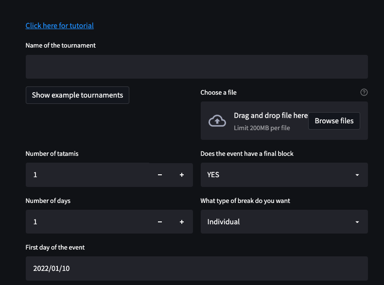
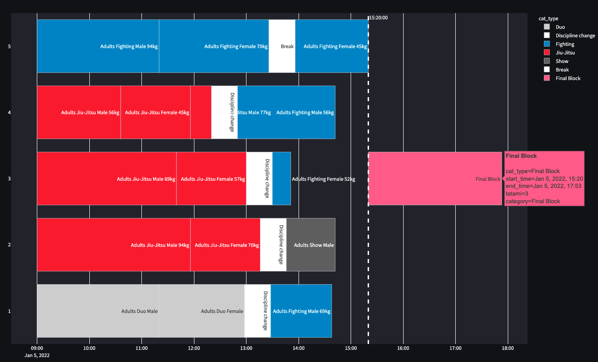
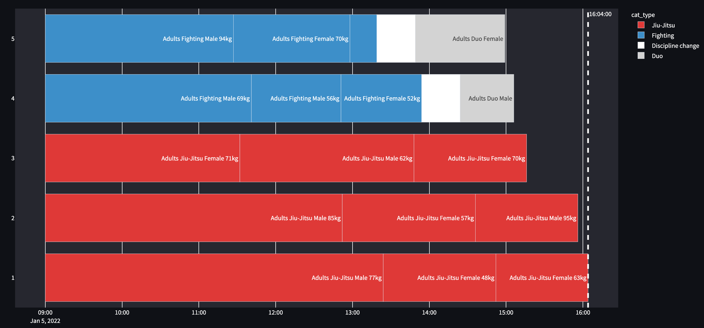
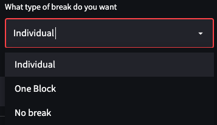
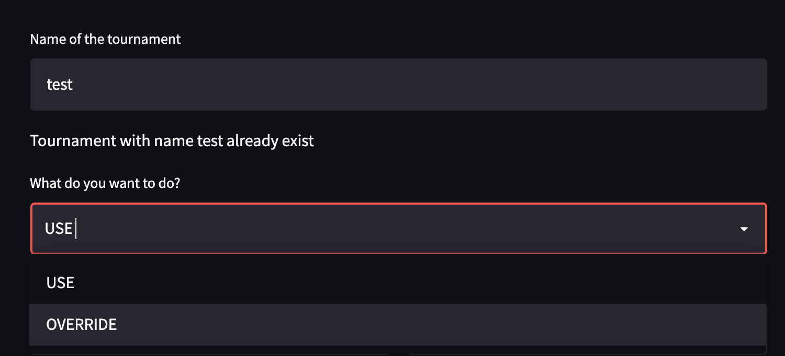

********
Tutorial
********

Once the app starts you will see a GUI like in this:

.. _start:

    First input fields of the GUI 

=======================
Create a new tournament 
=======================

You can change the values by typing or using the +/- buttons

#. Enter a name in "Name of the tournament" - [string] 
#. Number of Tatamis - [int]
#. Number of days - [int]
#. Does the event have a final block - [bool]
#. Type of break [switch]

While the name, the tatamis and days are trivial the two field 
on the left have some implication for the program.

Final block
-----------

If the event has a final block you can set this field to "YES".
Then all categories with more than 5 athletes will have on 
fight subtracted from the preliminary.

Those fights will be added in a final block which is then put at the end on 
a center tatami.

.. _with_final:

    Result when setting final block to YES 

.. _no_final:

    Result when setting final block to NO

Type of break
-------------

You can choose between three different types of breaks:

.. _break_sel:

    Options in the dropdrown menu

#.No break - no break will be added

===========================
Read in existing tournament 
===========================

If the name of the tournament was used before you have two options:

#. *Use*  Will read in all parameters stored in the text file
#. *Overwrite* Creates an empty event and overwrites the existing file

.. _start:

    Options for existing tournament 

The app has in version 0.9 the following pre-made tournaments

==========================
Create "random" tournament
==========================

If you name the tournament random the number of athletes and the days for each category will be automatically filled with positive integers, based on:

.. code-block::

	np.random.normal(8, 5.32)

which is a normaldistribution_ with :math:`\mu = 8`, :math:`\sigma = 5.32`. 

This can be used for testing or if one does not exactly know how many participants to expect on a event.
Please note that the random generator will rerun every time a parameters is changed.  

Change settings per day
-----------------------

==============
Known Problems
==============

After the GUI is started your standard browser should have opened. If not browser open you can open one and open the URL from your terminal:

.. code-block::

	You can now view your Streamlit app in your browser.

  	Local URL: http://localhost:8501
  	Network URL: http://192.168.178.46:8501

.. _normaldistribution: https://en.wikipedia.org/wiki/Normal_distribution
