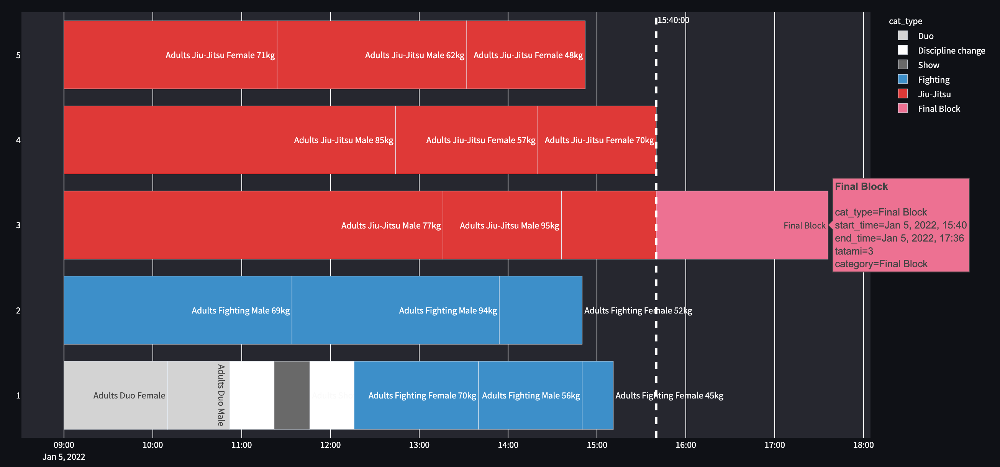
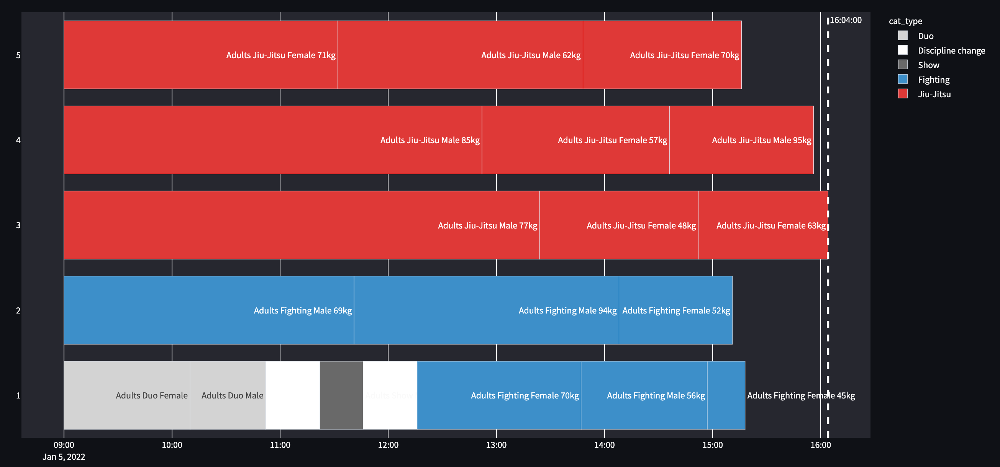
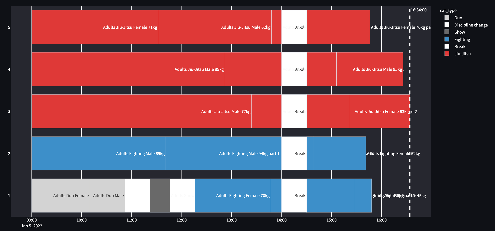
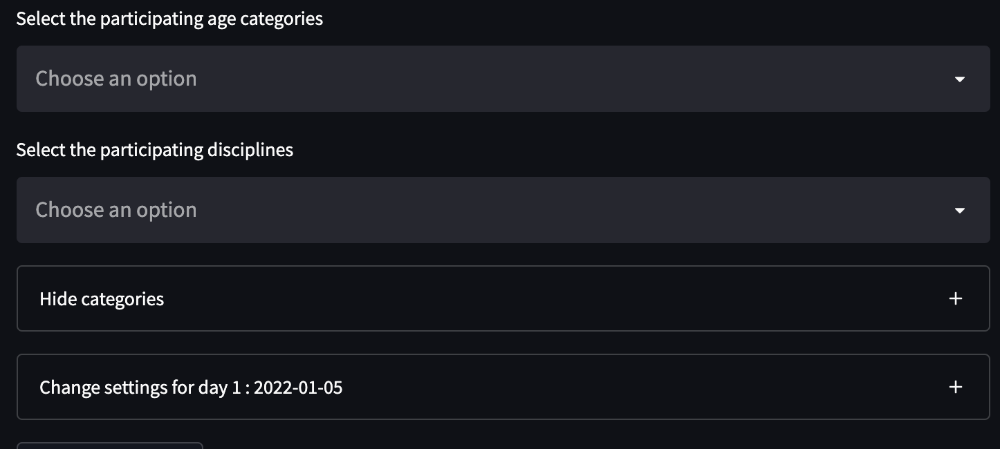
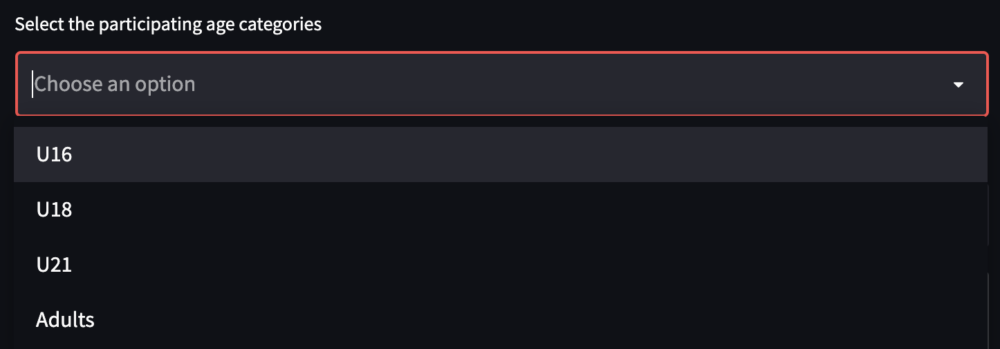
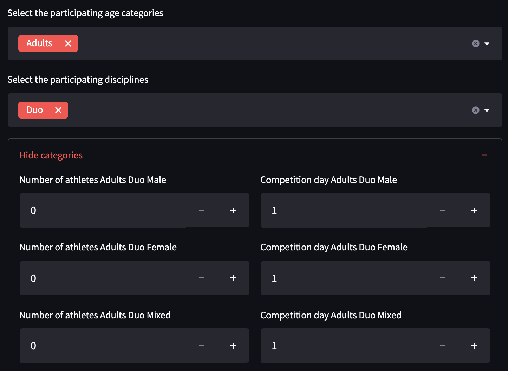

********
Tutorial
********

Once the app starts you will see a GUI like in this:

.. _start:

    First input fields of the GUI 

Read in tournaments 
===================

The app allows you to either read in tournament an example tournament, a tournament from a file or create a new event. 

If want to create a new tournament from scratch you do not need to add anything and to not use any file 

.. _read_in:

    Read in tournament 

Read in example tournament 
--------------------------

If the name of the tournament was used before you have two options:

#. *Use* -  Will read in all parameters stored in the text file
#. *Overwrite* - Creates an empty event and overwrites the existing file

.. _exist:
.. figure:: pictures/exist_tour.png

    Options for existing tournament 

The app has in version 0.9 the following pre-made tournaments:

.. _premade:
.. table:: existing tournaments in online app
    :align: center
    
    +--------------+------------------------------------+
    | Name         | Description                        |
    +==============+====================================+
    | Adults_2days | test event [#]_                    |
    |              | 2 days, adults & all disciplines   |    
    +--------------+------------------------------------+
    | U21_U18_3days| 3 days, U21&U18, all disciplines   |
    +--------------+------------------------------------+
    | WCh21        | the World Championship 2021        |
    |              | 9 days, all ages & disciplines     | 
    +--------------+------------------------------------+
  
.. [#] Was used to generate the pictures in this tutorial

You can always use the "show example tournaments button" to check which events are available.

If you reuse and existing tournament the entries (number of athletes and day) 
for all categories are imported and filled. You can still modify them by using the +/- button or by entering a number to the field. 

.. _read_in_tour:

Read in tournament - from file
------------------------------

Once you have created a tournament you can always read it back in from an .csv file.
It's the best if you create the input file by saving the data from (See :ref:`save_data`) an event to make sure to have the right structure. 

Structure of input file
^^^^^^^^^^^^^^^^^^^^^^^

This is an example how  the input data should look like:

.. code-block::

    categories;participants;day
    tatamis;5
    days;2
    finalblock;YES
    breaktype;Individual
    startime;32400
    date;2022-01-10
    Adults Duo Male;7;2
    Adults Duo Mixed;6;1
    Adults Duo Female;10;2
    Adults Show Male;7;1
    Adults Show Mixed;12;1
    Adults Show Female;6;2
    Adults Jiu-Jitsu Male 56kg;3;1
    Adults Jiu-Jitsu Male 62kg;8;2
    Adults Jiu-Jitsu Male 69kg;5;1
    Adults Jiu-Jitsu Male 77kg;14;2
    Adults Jiu-Jitsu Male 85kg;14;2
    Adults Jiu-Jitsu Male 94kg;6;2
    Adults Jiu-Jitsu Male 95kg;7;1
    Adults Jiu-Jitsu Female 45kg;19;2
    Adults Jiu-Jitsu Female 48kg;1;1
    Adults Jiu-Jitsu Female 52kg;7;1
    Adults Jiu-Jitsu Female 57kg;6;2

Create a new tournament 
=======================

You can change the values by typing or using the +/- buttons

#. Enter a name in "Name of the tournament" - [string] 
#. Number of Tatamis - [int]
#. Number of days - [int]
#. Does the event have a final block - [bool]
#. Type of break - [switch]
#. First day of the event - [date]

The first day of the event can set used fur multi day events. Then all figures show the relevant date. 

While the name, the tatamis (competition areas) and days are trivial the two field 
on the left have some implication for the program.

Final block
-----------

If the event has a final block you can set this field to "YES".
Then all categories with more than 5 athletes will have on 
fight subtracted from the preliminary.

Those fights will be added in a final block which is then put at the end on 
a center tatami.

.. _with_final:

    Result when setting final block to YES 

.. _no_final:

    Result when setting final block to NO

Type of break
-------------

You can choose between three different types of breaks:

.. _break_sel:

    Options in the drop drown menu

#. *No break* - no break will be added
#. *Individual* - break are planned after a category is finished
#. *One block* - a block of breaks is added, categories are split. This can be used for an opening ceremony f.e.  

.. _break_ind:

    Individual breaks are added

.. _break_block:

    A block of breaks are added

The time and the length of the break can be adapted in the settings per day 

Adding of participants 
======================

After the basic info is set it is time to add participants to your tournament.
Using the selection field: 

.. _cat_cre:

    
    Selection to add participants

One can select the following age divisions:

.. _age_sel:

And the following disciples 

.. _dis_sel:

Once the participating age divisions and disciples are crated one 
can hide/unhide the categories and enter participants in each discipline.
This can be done by using the +/- button or by entering a number to the field.

.. _examp_sel:

    
    Options to add to participants 

Adding "random" participants
-----------------------------

.. _random:

    
If you check"random participants" the number of athletes and the days for each category will be automatically filled with positive integers, based on:

.. code-block::

	np.random.normal(8, 5.32)

which is a normaldistribution_ with :math:`\mu = 8`, :math:`\sigma = 5.32`. 

This can be used for testing or if one does not exactly know how many participants to expect on a event.
Please note that the random generator will rerun every time a parameters is changed.  

.. _save_data:

Save the input
==============

After every run you can save the data of the event as a .csv file using the download button

.. _download:

You can later read it in like described in :ref:`read_in_tour`

Change settings per day
=======================

Per day the following parameters can be changed: 

#. *Length of the break* - change the during of the break for this day
#. *Start time of the break* - change the start time of the break for this day
#. *Start time of the event* - Change the start time of the event
#. *Number of tatamis* - Change the number of tatamis for this day 

.. day_set:

You can later read it in like described in :ref:`read_in_tour`

Understand the results
=======================

After entering all parameters and pressing the button "all info is correct" the algorithm will run. This should take maximum a few seconds.

You will see an example schedule and some details like in figure :numref:`best_res_show`

.. _best_res_show:

    
    Shows the data for the best results  

all other options are hidden under the field:
There are X possible results for day Y. Open Details

Furthermore, you can see the matrix as described in :ref:`best_result`.

Known Problems & improvements 
=============================

GUI is not visible
------------------

After the GUI is started your standard browser should have opened. If not browser open you can open one and open the URL from your terminal:

.. code-block::

	You can now view your Streamlit app in your browser.

  	Local URL: http://localhost:8501
  	Network URL: http://192.168.178.46:8501

Other issues
------------

`Pull requests <https://docs.github.com/en/pull-requests/collaborating-with-pull-requests/proposing-changes-to-your-work-with-pull-requests/creating-a-pull-request>`_
are welcome.

.. _normaldistribution: https://en.wikipedia.org/wiki/Normal_distribution
