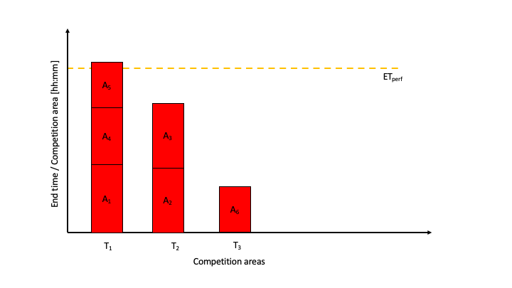

=============
Introduction
=============

Scheduling of sports tournaments can be approximated with the so-called multiprocessor scheduling, which is a known NP-hard problem of computer science.  With this, the goal is to find a :term:`minimum end-time` :math:`ET_{min}` of the tournament with distribution the different categories on a given number of :term:`competition area` s :math:`T`. A :term:`category` here is defined in agreement with the Organization and Sporting Code (Version 3.1)  OSC_ of the Ju-Jitsu International Federation (JJIF) under paragraph 1.3 (Disciplines, Divisions and Categories). However, the program shall also provide a base for integration of more disciplines or even of other sports.

=======================
Creation of input data
=======================
The first step is the creation of the input data. Since the names of categories in the tournament calculator are based on 1.3.3 of the OSC the user only needs to select one or more :term:`age category` [#]_  and :term:`discipline` [#]_. All categories are created, and the user is asked to add the number of :term:`athletes/couples` for each category. Based on the competition systems (as defined in the OSC under 4.4) the :term:`number of matches` :math:`N_{m}(n_{a})` for each category is known and can be described the following.

.. math::
    N_{m}(n_{a})= \begin{cases}
      d(n_{a}) , &n_{a} < 7\\
      2 \cdot n_a - 5, & n_{a} \geq 7 \\
    \end{cases}
    \\ \text{ with } d(n_{a} \to N_{m}; 0 \to 0, 1 \to 0, 2 \to 3, 3\to 3, 4 \to 6, 5 \to 10, 6 \to 9)
 
c`NmNa` shows the number of matches :math:`N_{m}` as a function of the number of athletes :math:`n_{a}`.

.. _NmNa:

    Number of matches :math:`N_{m}` as a function of the number of athletes :math:`n_{a}`.
    
The :term:`individual time` :math:`l` for each category can be calculated as on the number of matches :math:`N_{m}` times the :term:`average match time per discipline` :math:`<t_{x}>` (See :numref:`avtime` average match time per discipline). The average match time covers the span between the starting of one match and the starting of the next match, including interruptions of the fight and the change of the fighters. This value is based on the experience and used as well in [SD, JJW, SM]. It may vary based on the place and the time of the tournament and can be individually adjusted in the software.

.. _avtime:
.. table:: average match time per discipline
    :align: center
    
    +------------+------------------------------------+
    | Discipline | Average match time :math:`<t_{x}>` |
    +============+====================================+
    | Jiu-Jitsu  | 8 min                              |
    +------------+------------------------------------+
    | Fighting   | 6 min 30 sec                       |
    +------------+------------------------------------+
    | Duo        | 7 min                              |
    +------------+------------------------------------+
    | Show       | 3 min                              |
    +------------+------------------------------------+

The individual time :math:`l_{xy}` is calculated as the following:

.. math::
    l_{yx}= N_{m} (n_{a} ) <t_{x}>

In total the input data can be described the following:
There are :math:`X` disciplines. Each discipline has :math:`Y` individual categories with each category an individual time of :math:`l_{xy}`. Hereby is:

.. math::
    L_{X} = \sum_{y=1}^Y l_{xy} \text{ and } \\
    L_{tot} = \sum_{x=A}^X L_{x} = \sum_{x=A}^X \sum_{y=1}^Yl_{xy} ,

where :math:`L_{x}` is the total discipline time, and :math:`L_{tot}` is the total time for the full tournament. For a better understanding, see :numref:`input` Visualization of an example input dataset.

.. _input:

    Visualization of an example input dataset. Here, the discipline :math:`A` (in red) has :math:`M` individual categories with each an induvial duration of :math:`l_{AM}`. The total time of this discipline is :math:`L_A`
    
Based on :math:`L_{tot}` and the number of competition areas :math:`T` an (artificial) :term:`perfect end-time` :math:`ET_{perf}` can be calculated the following:

.. math::
    ET_{perf}=\frac{L_{tot}}{T}

.. [#] Adults, U21, U18 and U16 are supported in the version 0.1.0
.. [#] Jiu-Jitsu, Fighting, Duo and Show system are supported in the version 0.1.0

========================================================
Longest Processing Time algorithm – Approximate solution
========================================================

The above-described problem can be approximately solved with the LPT_ algorithm (Longest Processing Time). It sorts the categories by their time :math:`l`, from longest to shortest.  Then assigns them one after annother to competition area :math:`T` with the earliest end time so far. The logical assumption is made that only one category can be run per competition area at the same moment in time.
Since the number of categories is usually very small (<<1000), this straightforward algorithm seems to be a good starting point. However, it needs to be modified to full fill the requirements of multi-discipline tournaments. Here not all referees can work on all competition areas due to individual qualifications.

-------------------------------------------------------------------
Splitting of disciplines with dynamic creation of competition areas
-------------------------------------------------------------------

In the JJIF referees are specialized per discipline Referee_. Therefore, it is crutial to minimize the change of disciplines for the individual competition areas :math:`T` to avoid time-consuming commuting of qualified referees. To realize this, we choose to individually distribute the categories based on the above described LPT algorithm.
This requires, that for a given discipline, only needed competition areas are created.
Hereby we used a so-called Euclidean_ Division:
    “Given two integers :math:`a` and :math:`b`, with :math:`b \neq 0`, there exist unique integers :math:`q` and :math:`r `such that
    :math:`a = bq + r` and :math:`0 ≤ r < |b|` where :math:`|b|` denotes the absolute value of :math:`b`. In the above theorem, each of the four integers has a name of its own: :math:`a` is called the dividend, :math:`b` is called the divisor, :math:`q` is called the quotient and :math:`r` is called the remainder.”

In the case of the described data, we can define analogous a Euclidean Division with the following components:

    - dividend =   total time of this discipline :math:`L_{a}`
    - divisor =    perfect end-time :math:`ET_{perf}`
    - quotient =   :term:`fully-used` competition area :math:`N_{Ta}`
    - remainder =  :term:`remainder time` :math:`t_{r}`
    
This converts the above-mentioned relation to:

.. math::
    L_{a} = ET_{perf} \cdot N_{Ta}  + t_{r} : a \in \{A, B, ⋯, X\}

Where :math:`a` is the name of the discipline. In our case the dividend (total time of this discipline :math:`L_{a}`) and the divisor (perfect end-time :math:`ET_{perf}`) are known, and we want to compute the total number of tatamis.

The name fully competition areas used shall also imply that the end time of this competition area :math:`ET_{T}` is as close as possible to perfect end-time :math:`ET_perf.` To calculate the number of fully-used competition areas per discipline for the above relation one can use the well-known integer division in computer science:

.. math::
    N_{Ta}=INT \frac{L_{a}}{E_{perf}} : a  \in ]\{A, B, ⋯, X\}

The remainder of the Euclidean Division is the remainder time :math:`t_r` and might be used to create a new competition area it is called :term:`partially-used`.

Example
=======
Since these mathematical expressions might not be familiar to many readers, we would like to give the following example:

Assuming we have a discipline A with a total discipline time of :math:`L_{A}`: 22:30 (=22 hrs and 30 min). The perfect end-time :math:`ET_{perf}`: of the tournament is 7:00 (7 hrs and 0 min).

The amount of fully used tatamis is

.. math::
    N_{Ta}=INT \frac{L_{a}}{E_{perf}} =INT \frac{22:30}{7:00} =INT(3.21)=3

The remainder time :math:`t_{r}` is 1h and 30 min, which might need to be added either to existing partially used competition area or created a new one.

--------------------------------
Partially used competition areas
--------------------------------

If fully used or partially used competition areas are created strongly depends on the total discipline time :math:`L_{x}`, the perfect end-time :math:`ET_{perf}` and the amount of already created competition areas. We will discuss all distinct possibilities in dedicated examples below to make them better understandable.

Possibility 1: No competition areas exists. :math:`L_{x}Lx  < ET_{perf}`
------------------------------------------------------------------------
In this first example, we want to explain the way the algorithm reacts when first called.
We assume that :math:`L_{x}Lx  < ET_{perf}`. In the first step, the amount of fully used competition area is calculated, and those are created. Since :math:`L_{x}Lx  < ET_{perf}`, the remainder time must be larger than zero. Since no further competition area exists an additional partially-used competition area is created. This scenario is shown in :numref:`noPar`.

.. _noPar:

    Visualization of expexted behaviour with three identical competition areas and two disciplines

The LPT algorithm would tread all created competition areas the same, which would lead to an even distribution of end times :math:`ET_{T}` for all 3 competition areas. However, is :math:`ET_{T}` rather far away from the perfect end time,  meaning we cannot consider these competition areas full used. If the next discipline is distributed, categories might be added to all the competition area introducing a change of the discipline which is not desired.
To avoid this, we will add adn :term:`placeholder time block` at the partically used tatamis. The lenth of this placeholder time block is :math:`ET_{perf}-t_{r}`. It will be removed after the dicscipline allocation, leaving a very uneven distribtution. This will allow the next discipline to be added on the partially-used competition area. This behaviour is visualized in :numref:`withPar`.

.. _withPar:

--------------------------------------------------------------
Diszipline Change - penalty factor for changeing a discipline 
--------------------------------------------------------------

Changeing the discipline will possible need adjustment of the referees and the setup of the field of play. Therefore a pentaly factor called diszipline change in introduced.
After the distribtuon of a discipline this penalty factor is added. 
This parameter is :math:`T_{pen}` and will be later varied.

.. _pent:

================
Free parameters 
================

The algorithm has three free and and abitraty parameters () which need to be varied to find the optimal solution.

-------------------------
Order of the disciplines 
-------------------------

[('Duo', 'Show', 'Jiu-Jitsu', 'Fighting'), ('Duo', 'Show', 'Fighting', 'Jiu-Jitsu'), ('Duo', 'Jiu-Jitsu', 'Show', 'Fighting'), ('Duo', 'Jiu-Jitsu', 'Fighting', 'Show'), ('Duo', 'Fighting', 'Show', 'Jiu-Jitsu'), ('Duo', 'Fighting', 'Jiu-Jitsu', 'Show'), ('Show', 'Duo', 'Jiu-Jitsu', 'Fighting'), ('Show', 'Duo', 'Fighting', 'Jiu-Jitsu'), ('Show', 'Jiu-Jitsu', 'Duo', 'Fighting'), ('Show', 'Jiu-Jitsu', 'Fighting', 'Duo'), ('Show', 'Fighting', 'Duo', 'Jiu-Jitsu'), ('Show', 'Fighting', 'Jiu-Jitsu', 'Duo'), ('Jiu-Jitsu', 'Duo', 'Show', 'Fighting'), ('Jiu-Jitsu', 'Duo', 'Fighting', 'Show'), ('Jiu-Jitsu', 'Show', 'Duo', 'Fighting'), ('Jiu-Jitsu', 'Show', 'Fighting', 'Duo'), ('Jiu-Jitsu', 'Fighting', 'Duo', 'Show'), ('Jiu-Jitsu', 'Fighting', 'Show', 'Duo'), ('Fighting', 'Duo', 'Show', 'Jiu-Jitsu'), ('Fighting', 'Duo', 'Jiu-Jitsu', 'Show'), ('Fighting', 'Show', 'Duo', 'Jiu-Jitsu'), ('Fighting', 'Show', 'Jiu-Jitsu', 'Duo'), ('Fighting', 'Jiu-Jitsu', 'Duo', 'Show'), ('Fighting', 'Jiu-Jitsu', 'Show', 'Duo')]

.. _OSC: http://www.jjif.org/fileadmin/documents/Competition-Ranking/Organization_and_sporting_code_2020.pdf

.. _Referee:
    http://jjif.org/fileadmin/JJIF/minutes/board/_MINUTES_5th_JJIF_Board_Abu_Dhabi__.4.2017.pdf

.. _LPT:
    https://en.wikipedia.org/wiki/Multiprocessor_scheduling
    
.. _Euclidean:
    https://en.wikipedia.org/wiki/Euclidean_division

========
Gloassay
========
.. glossary::
    age category
        An age categorie defines the minumim and maximum age of a participant
        
    minimum end-time
        The time after the last match has finished; :math:`ET_{min}`
        
    discipline
        A discipline is a branch of a sport which has a set of rules. For this program disciplines might have a different time and different referees
        
    category
        A category is a
    
    competition area
        A competition area can hold one match at the same time
    
    number of matches
        Number of individual matches per category. It depens on the number of athletes/couples in this category
        
    athletes/couples
        Paricipants in a category
        
    individual time
        For
        
    average match time per discipline
        fdg
        
    perfect end-time
        Total fight time divided by the number of competition area
        
    fully-used
        fully used competition area
    
    partially-used
        paritally-used competition area
        
    remainder time
        remainder time

    placeholder time block
        time bloc at partially used tatamis
